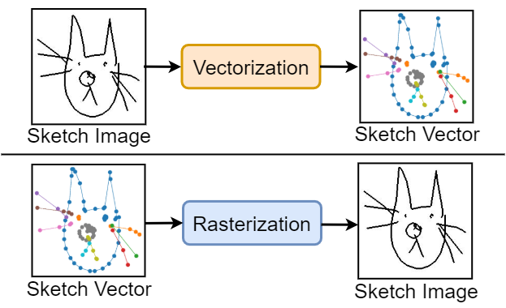
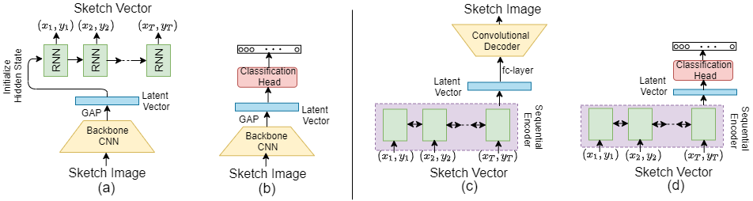

# Vectorization and Rasterization: Self-Supervised Learning for Sketch and Handwriting, CVPR 2021.
**Ayan Kumar Bhunia**, Pinaki nath Chowdhury, Yongxin Yang, Timothy Hospedales, Tao Xiang, Yi-Zhe Song, “Vectorization and Rasterization: Self-Supervised Learning for Sketch and Handwriting”, IEEE Conf. on Computer Vision and Pattern Recognition (**CVPR**), 2021. 

## Abstract
Self-supervised learning has gained prominence due to its efficacy at learning powerful representations from unlabelled data that achieve excellent performance on many challenging downstream tasks. However, supervision-free pre-text tasks are challenging to design and usually modality specific. Although there is a rich literature of self-supervised methods for either spatial (such as images) or temporal data (sound or text) modalities, a common pre-text task that benefits both modalities is largely missing. In this paper, we are interested in defining a self-supervised pre-text task for sketches and handwriting data. This data is uniquely characterised by its existence in dual modalities of  rasterized images and vector coordinate sequences. We address and exploit this dual representation by proposing two novel cross-modal translation pre-text tasks for self-supervised feature learning: Vectorization and Rasterization. Vectorization learns to map image space to vector coordinates and  rasterization maps vector coordinates to image space. We show that our learned encoder modules benefit both raster-based and vector-based downstream approaches to analysing hand-drawn data. Empirical evidence shows that our novel pre-text tasks surpass existing single and multi-modal self-supervision methods.

## Outline


**Figure:** Schematic of our proposed self-supervised method for sketches. Vectorization drives representation learning for sketch images; rasterization is the pre-text task for sketch vectors.
## Architecture


**Figure:** Illustration of the architecture used for our self-supervised task for sketches and handwritten data (a,c), and how it can subsequently be adopted for downstream tasks (b,d). Vectorization involves translating sketch image to sketch vector (a), and the convolutional encoder used in the vectorization process acts as a feature extractor over sketch images for downstream tasks (b). On the other side, rasterization converts sketch vector to sketch image (c), and provides an encoding for vector-based recognition tasks downstream (d).

## Citation

If you find this article useful in your research, please consider citing:
```
@InProceedings{sketch2vec,
author = {Ayan Kumar Bhunia and Pinaki Nath Chowdhury and Yongxin Yang and Timothy Hospedales and Tao Xiang and Yi-Zhe Song},
title = {Vectorization and Rasterization: Self-Supervised Learning for Sketch and Handwriting},
booktitle = {The IEEE Conference on Computer Vision and Pattern Recognition (CVPR)},
month = {June},
year = {2021}
}
```
## Work done at SketchX Lab, CVSSP, University of Surrey. 
